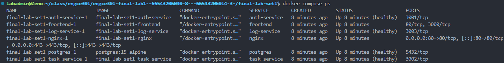
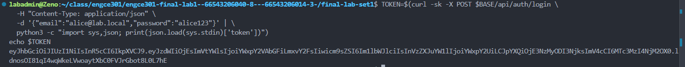
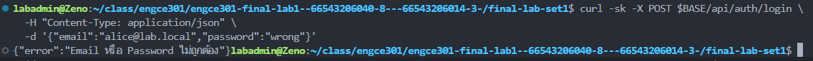
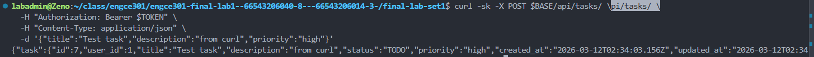
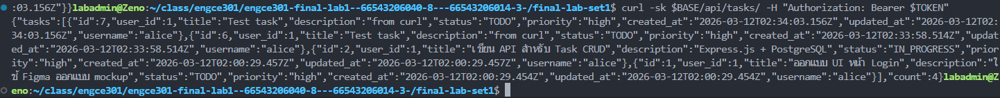
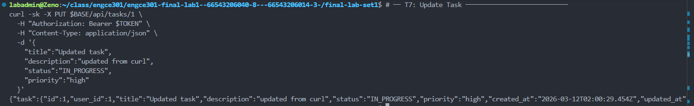
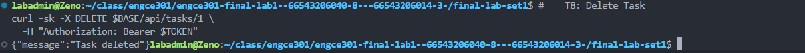
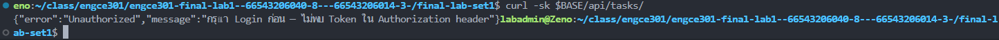
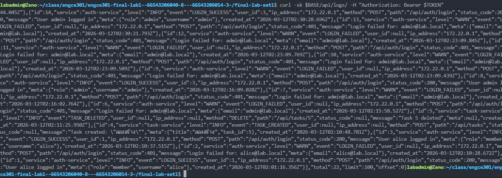
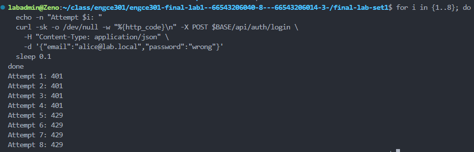

# ENGCE301 Final Lab
## Microservices Task Board with HTTPS, JWT Authentication and Logging

---

## 1. ชื่อโครงงาน

**Secure Task Board Microservices System**

ระบบ Task Board ที่พัฒนาในรูปแบบ **Microservices Architecture**  
มีการใช้ **HTTPS, JWT Authentication และ Activity Logging**

ระบบประกอบด้วยหลาย Service ที่แยกหน้าที่กันชัดเจน และทำงานผ่าน **Nginx API Gateway**

---

## 2. สมาชิกกลุ่ม

| ชื่อ | รหัสนักศึกษา | หน้าที่ |
|-----|-----|-----|
| สมาชิก 1 | 66543206070-5 | Auth Service / JWT |
| สมาชิก 2 | 66543206014-3 | Task Service |
| สมาชิก 3 | 66543206040-8 | Frontend / Logging |

---

## 3. ภาพรวมระบบ

ระบบนี้เป็น **Task Management System** ที่ผู้ใช้สามารถ

- Login เข้าสู่ระบบ
- สร้าง Task
- แก้ไข Task
- ลบ Task
- ดู Activity Logs

ระบบออกแบบเป็น **Microservices Architecture** โดยมี Service หลักคือ

- Auth Service
- Task Service
- Log Service
- Nginx Gateway
- PostgreSQL Database

การสื่อสารทั้งหมดผ่าน **HTTPS**

---

## 4. Architecture Overview

```
Browser
│
│ HTTPS
▼
Nginx API Gateway
│
├── /api/auth → Auth Service
├── /api/tasks → Task Service
├── /api/logs → Log Service
└── / → Frontend
│
▼
PostgreSQL
```

### Services ในระบบ

| Service | Port | Description |
|-------|------|-------------|
| nginx | 80 / 443 | API Gateway + HTTPS |
| auth-service | 3001 | Login และ JWT |
| task-service | 3002 | Task CRUD |
| log-service | 3003 | Activity Logging |
| postgres | 5432 | Database |

---

## 5. Auth Service

Auth Service ทำหน้าที่

- ตรวจสอบ user login
- สร้าง JWT Token
- ตรวจสอบ Token validity

### Endpoints

```
POST /api/auth/login
GET /api/auth/verify
GET /api/auth/me
```

ระบบนี้ **ไม่มี Register**

ใช้ **Seed Users ใน database**

---

## 6. Task Service

Task Service ทำหน้าที่

- สร้าง Task
- อ่าน Task
- แก้ไข Task
- ลบ Task

ทุก endpoint ต้องมี **JWT Token**

### Endpoints

```
GET /api/tasks
POST /api/tasks
PUT /api/tasks/:id
DELETE /api/tasks/:id
```

---

## 7. Database Design

ใช้ **PostgreSQL Database**

### users table

```
id
username
email
password_hash
role
created_at
last_login
```

### tasks table

```
id
user_id
title
description
status
priority
created_at
updated_at
```

### logs table

```
id
service
level
event
user_id
ip_address
method
path
status_code
message
meta
created_at
```

---

## 8. Nginx HTTPS Gateway

Nginx ทำหน้าที่

- API Gateway
- Reverse Proxy
- HTTPS Termination
- Rate Limiting

### Routing

```
/api/auth/* → auth-service
/api/tasks/* → task-service
/api/logs/* → log-service
/ → frontend
```

HTTP requests จะถูก redirect ไป HTTPS

```
http://localhost
→ https://localhost
```

---

## 9. JWT Authentication Flow

```
User Login
│
▼
POST /api/auth/login
│
▼
Auth Service ตรวจสอบ user
│
▼
สร้าง JWT Token
│
▼
Frontend เก็บ token ใน localStorage
│
▼
ส่ง Authorization header
```

### Authorization Header

```
Authorization: Bearer <JWT_TOKEN>
```

Task Service จะตรวจสอบ Token ก่อนทุก request

---

## 10. Activity Log Integration

ระบบมี **Log Service** สำหรับเก็บ event ต่าง ๆ

| Event | Description |
|-----|-----|
| LOGIN_SUCCESS | login สำเร็จ |
| LOGIN_FAILED | login ล้มเหลว |
| TASK_CREATED | สร้าง task |
| TASK_DELETED | ลบ task |
| JWT_INVALID | token ผิด |

Logs จะถูกบันทึกลง **PostgreSQL**

Frontend สามารถเรียก

```
GET /api/logs
```

เพื่อดู logs

---

## 11. Frontend Application

Frontend เป็น **Static Web Application**

### หน้าในระบบ

**index.html**

หน้า Task Board

สามารถ

- login
- create task
- edit task
- delete task

### Features

- JWT inspector
- role display
- task filtering

---

## 12. Log Viewer

หน้า

```
logs.html
```

ใช้สำหรับดู logs จากระบบ

### Features

- Filter logs
- Search logs
- Auto refresh
- Log statistics

---

## 13. วิธี Run ระบบ

### 1 Generate Certificate

```bash
chmod +x scripts/gen-certs.sh
./scripts/gen-certs.sh
```

### 2 Copy Environment File

```bash
cp .env.example .env
```

### 3 Run Docker

```bash
docker compose up --build
```

### เปิดระบบ

```
https://localhost
```

---

## 14. Environment Variables

ตัวอย่างไฟล์ `.env`

```
POSTGRES_DB=taskboard
POSTGRES_USER=admin
POSTGRES_PASSWORD=secret123

JWT_SECRET=super-secret-key
JWT_EXPIRES=1h
```

---

## 15. Sample API Usage

### Login

```
POST /api/auth/login
```

```json
{
  "email": "alice@lab.local",
  "password": "alice123"
}
```

---

### Get Tasks

```
GET /api/tasks
```

Header

```
Authorization: Bearer TOKEN
```

---

### Create Task

```
POST /api/tasks
```

```json
{
  "title": "Test task"
}
```

---

## 16. การทดสอบระบบ

สามารถใช้

- Postman
- curl
- Browser

### ตัวอย่าง curl

#### Login

```bash
curl -X POST https://localhost/api/auth/login \
-H "Content-Type: application/json" \
-d '{"email":"alice@lab.local","password":"alice123"}'
```

#### Get Tasks

```bash
curl https://localhost/api/tasks \
-H "Authorization: Bearer TOKEN"
```

## 17. System Screenshots

โฟลเดอร์ `screenshots/` มีหลักฐานการทดสอบระบบ

### Docker Containers Running

<p align="center">

</p>

---

### HTTPS Access via Browser

<p align="center">

</p>

---

### Login Success

<p align="center">

</p>

---

### Login Failed

<p align="center">

</p>

---

### Create Task

<p align="center">

</p>

---

### Get Tasks API

<p align="center">

</p>

---

### Update Task

<p align="center">

</p>

---

### Delete Task

<p align="center">

</p>

---

### Unauthorized Request (No JWT)

<p align="center">

</p>

---

### Logs API

<p align="center">

</p>

---

### Rate Limiting Test

<p align="center">

</p>

## 18. ปัญหาที่พบและวิธีแก้

### ปัญหา 1  
JWT Token ไม่ถูกส่งไป backend

วิธีแก้

```
Authorization: Bearer token
```

---

### ปัญหา 2  
HTTPS certificate warning

สาเหตุ

ใช้ **self-signed certificate**

วิธีแก้

กด **Continue** ใน browser

---

### ปัญหา 3  
Docker container start ก่อน database

วิธีแก้

ใช้

- `depends_on`
- `healthcheck`

---

## 19. สิ่งที่ยังไม่สมบูรณ์

- ยังไม่มี User Registration
- ยังไม่มี Role management ขั้นสูง
- ยังไม่มี UI สำหรับแก้ไข Logs

ในอนาคตสามารถพัฒนาเพิ่มเติม

- Pagination logs
- Dashboard analytics
- Notification system

---

## Seed Users สำหรับทดสอบ

| Username | Email | Password | Role |
|--------|------|------|------|
| alice | alice@lab.local | alice123 | member |
| bob | bob@lab.local | bob456 | member |
| admin | admin@lab.local | adminpass | admin |

---